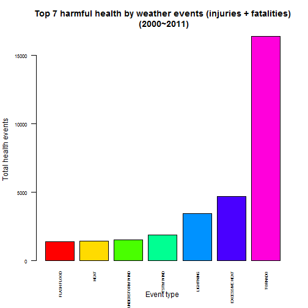
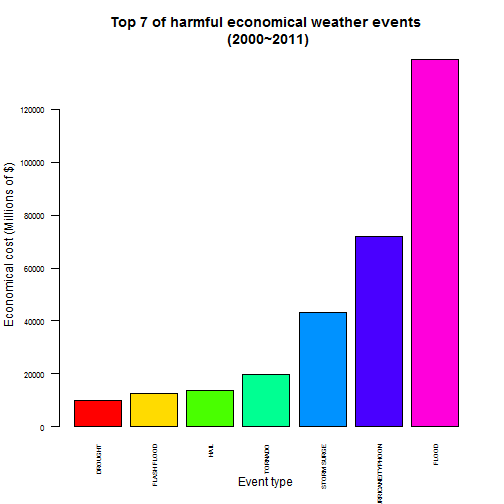

# How severe weather impact in the USA
======================================

## 1- Synopsis

This analysis it's part of second Peer Assessment of Reproducible Research course.

The origin of the data it's the NOAA storm database (U.S. National Oceanic and Atmospheric Administration's) which tracks characteristics of major storms and weather events in the United States between 1950 and 2011, including when and where they occur, as well as estimates of any fatalities, injuries, and property damage.

We'll try to address the following questions:

- Across the United States, which types of events (as indicated in the EVTYPE variable) are most harmful with respect to population health?

- Across the United States, which types of events have the greatest economic consequences?

To answer these questions it will be only represented data between 2000 and 2011, and, because of the large type of different events, the top seven of them.

## 2- Data processing

### Auxiliar functions:


```r
"
Function to delete spaces before and after a string
"
```

```
## [1] "\nFunction to delete spaces before and after a string\n"
```

```r
trim <- function (x) gsub("^\\s+|\\s+$", "", x)

"
Function that transform a exp letter in number:
- '' : 1
- 'H': 100
- 'K': 1000       (Kilo)
- 'M': 1000000    (Millions)
- 'B': 1000000000 (Billions)
"
```

```
## [1] "\nFunction that transform a exp letter in number:\n- '' : 1\n- 'H': 100\n- 'K': 1000       (Kilo)\n- 'M': 1000000    (Millions)\n- 'B': 1000000000 (Billions)\n"
```

```r
multiply_number_with_exp_letter <- function(num, exp_letter, miles_factor)
{
   
   exp_letter<-tolower(trim(exp_letter))
  
   conversion <- ifelse(exp_letter=="h",100,
                   ifelse(exp_letter=="k",1000,
                     ifelse(exp_letter=="m",1000000,
                       ifelse(exp_letter=="b",1000000000,0))))
  

   return((as.numeric(num)*conversion)/miles_factor)
}
```

### Loading and preprocessing the data

The data for this study can be downloaded from:

* Dataset: [Storm data [47Mb]] (https://d396qusza40orc.cloudfront.net/repdata%2Fdata%2FStormData.csv.bz2)

Make sure that you unzip the file and place it in the same directory of this file with the name "repdata_data_StormData.csv"


```r
weather_data_raw <- read.csv("./repdata_data_StormData.csv")
```

Selecting the columns of interest and selecting the registers since the
year 2000:

- BGN_DATE: date of the weather event
- EVTYPE: type of storm event
- FATALITIES: number of deaths by a weather event
- INJURIES: number of injuries by a weather event
- PROPDMG: estimation of the damage to the properties by a weather event
- PROPDMGEXP: scale of PROPDMG
- CROPDMG: estimation of the damage to the crops by a weather event
- CROPDMGEXP: scale of CROPDMG


```r
columns_of_interest <- c("BGN_DATE",
                         "EVTYPE",
                         "FATALITIES",
                         "INJURIES",
                         "PROPDMG",
                         "PROPDMGEXP",
                         "CROPDMG",
                         "CROPDMGEXP")

weather_data <- weather_data_raw[,columns_of_interest]
weather_data <- weather_data[
  as.Date(weather_data$BGN_DATE, format = "%m/%d/%Y %H:%M:%S") >=
  as.Date("2000-01-01"), ]
rm(weather_data_raw)
```
                        
### Creating new variables

We need the product of the columns of proppdmg and cropdmg with their scales in a new variable.


```r
weather_data$CROPDMG_NUMERIC <-
   multiply_number_with_exp_letter(weather_data$CROPDMG,
                                   weather_data$CROPDMGEXP,
                                   1000000)
weather_data$PROPDMG_NUMERIC <-
   multiply_number_with_exp_letter(weather_data$PROPDMG,
                                   weather_data$PROPDMGEXP,
                                   1000000)
```

### Other considerations

The column EVTYPE represents a total of 985 levels, for a more specific and deeper analysis we could reduce them by grouping the relationated events, for example:


```r
levels(weather_data$EVTYPE)[981:983]
```

```
## [1] "WINTERY MIX" "Wintry mix"  "Wintry Mix"
```
We can group it into a level called Wintry mix

## 3- Results

Across the United States, which types of events (as indicated in the EVTYPE variable) are most harmful with respect to population health?


```r
total_health_events <- sort(
  tapply(weather_data$FATALITIES +
         weather_data$INJURIES,
         weather_data$EVTYPE,
         sum)
)

barplot(tail(total_health_events, 7),
        main="Top 7 harmful health by weather events (injuries + fatalities)\n (2000~2011)",
        xlab="Event type",
        ylab="Total health events",
        las = 2,
        cex.names=0.5,
        cex.axis=0.7,
        col=rainbow(7))
```

 

We can conclude that the tornado it's the most harmful event that causes more injuries and fatalities to the population health.

Across the United States, which types of events have the greatest economic consequences?


```r
total_financial_cost <- sort(
  tapply(weather_data$CROPDMG_NUMERIC +
         weather_data$PROPDMG_NUMERIC,
         weather_data$EVTYPE,
         sum)
)

barplot(tail(total_financial_cost, 7),
        main="Top 7 of harmful economical weather events\n (2000~2011)",
        xlab="Event type",
        ylab="Economical cost (Millions of $)",
        las = 2,
        cex.names=0.5,
        cex.axis=0.7,
        col=rainbow(7))       
```

 

In this case we can conclude that the flood has the most harmful economical impact.

## 4- Conclusion

We need to invest more money to investigate ways to detect and reduce the number of harmful weather events in the USA in order to reduce the high financial and health costs of them.
