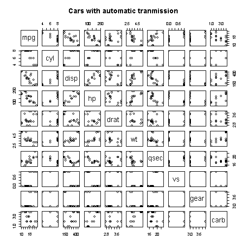
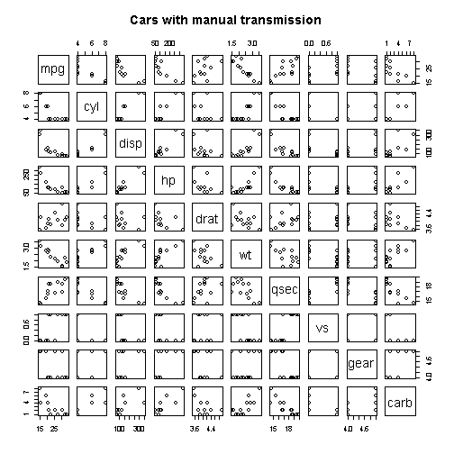
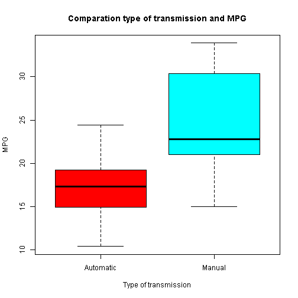
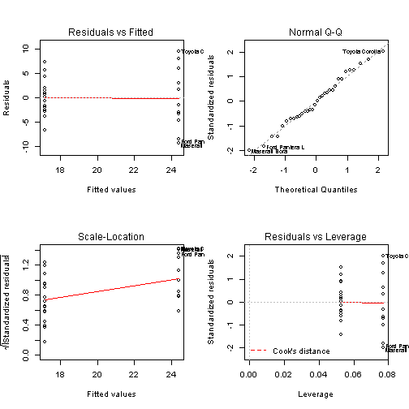

# Coursera - Regression Models (Course Project)
===============================================

## 1- Executive Summary

The main goals of this study it's to analyse a serie of differences between cars with manual or automatic transmission attending to it's consume.

Many people think that cars with automatic transmission have a better relation between gallons and miles, the true is that it's false, and this study will try to demonstrate it.

We will see a different type of plots and other metrics to illustrate it.

## 2 - Introduction

You work for Motor Trend, a magazine about the automobile industry. Looking at a data set of a collection of cars, they are interested in exploring the relationship between a set of variables and miles per gallon (MPG) (outcome). They are particularly interested in the following two questions:

* Is an automatic or manual transmission better for MPG
* Quantifying how different is the MPG between automatic and manual transmissions?"

## 3- Data processing

### Loading and preprocessing the data

The data it's included in "The R Datasets Package" included in RStudio.

It's only necessary make this call to load "mtcars".


```r
data(mtcars)
```
## 4- Exploratory data analyses

Seeing documentation of mtcars we see that exists a numeric variable  **am**
that represents 0 for automatic transmission and 1 for manual transmission.

Then we can split mtcars into to variables: mtcars_automatic and mtcars_manual

#### Resume of cars with automatic transmission:


```r
mtcars_automatic <- mtcars[mtcars$am=="0", -c(9)]

pairs(mtcars_automatic, 
      main = "Cars with automatic tranmission")
```

 

```r
summary(mtcars_automatic)
```

```
##       mpg            cyl            disp           hp           drat     
##  Min.   :10.4   Min.   :4.00   Min.   :120   Min.   : 62   Min.   :2.76  
##  1st Qu.:14.9   1st Qu.:6.00   1st Qu.:196   1st Qu.:116   1st Qu.:3.07  
##  Median :17.3   Median :8.00   Median :276   Median :175   Median :3.15  
##  Mean   :17.1   Mean   :6.95   Mean   :290   Mean   :160   Mean   :3.29  
##  3rd Qu.:19.2   3rd Qu.:8.00   3rd Qu.:360   3rd Qu.:192   3rd Qu.:3.69  
##  Max.   :24.4   Max.   :8.00   Max.   :472   Max.   :245   Max.   :3.92  
##        wt            qsec            vs             gear     
##  Min.   :2.46   Min.   :15.4   Min.   :0.000   Min.   :3.00  
##  1st Qu.:3.44   1st Qu.:17.2   1st Qu.:0.000   1st Qu.:3.00  
##  Median :3.52   Median :17.8   Median :0.000   Median :3.00  
##  Mean   :3.77   Mean   :18.2   Mean   :0.368   Mean   :3.21  
##  3rd Qu.:3.84   3rd Qu.:19.2   3rd Qu.:1.000   3rd Qu.:3.00  
##  Max.   :5.42   Max.   :22.9   Max.   :1.000   Max.   :4.00  
##       carb     
##  Min.   :1.00  
##  1st Qu.:2.00  
##  Median :3.00  
##  Mean   :2.74  
##  3rd Qu.:4.00  
##  Max.   :4.00
```

#### Resume of cars with manual transmission:


```r
mtcars_manual <- mtcars[mtcars$am=="1", -c(9)]

pairs(mtcars_manual, 
      main="Cars with manual transmission")
```

 

```r
summary(mtcars_manual)
```

```
##       mpg            cyl            disp             hp     
##  Min.   :15.0   Min.   :4.00   Min.   : 71.1   Min.   : 52  
##  1st Qu.:21.0   1st Qu.:4.00   1st Qu.: 79.0   1st Qu.: 66  
##  Median :22.8   Median :4.00   Median :120.3   Median :109  
##  Mean   :24.4   Mean   :5.08   Mean   :143.5   Mean   :127  
##  3rd Qu.:30.4   3rd Qu.:6.00   3rd Qu.:160.0   3rd Qu.:113  
##  Max.   :33.9   Max.   :8.00   Max.   :351.0   Max.   :335  
##       drat            wt            qsec            vs       
##  Min.   :3.54   Min.   :1.51   Min.   :14.5   Min.   :0.000  
##  1st Qu.:3.85   1st Qu.:1.94   1st Qu.:16.5   1st Qu.:0.000  
##  Median :4.08   Median :2.32   Median :17.0   Median :1.000  
##  Mean   :4.05   Mean   :2.41   Mean   :17.4   Mean   :0.538  
##  3rd Qu.:4.22   3rd Qu.:2.78   3rd Qu.:18.6   3rd Qu.:1.000  
##  Max.   :4.93   Max.   :3.57   Max.   :19.9   Max.   :1.000  
##       gear           carb     
##  Min.   :4.00   Min.   :1.00  
##  1st Qu.:4.00   1st Qu.:1.00  
##  Median :4.00   Median :2.00  
##  Mean   :4.38   Mean   :2.92  
##  3rd Qu.:5.00   3rd Qu.:4.00  
##  Max.   :5.00   Max.   :8.00
```

Before giving an answer to the questions of interest we go to compare, using a boxplot, both type of cars with the variable mpg:


```r
boxplot(mtcars$mpg~mtcars$am,
        main="Comparation type of transmission and MPG",
        xlab ="Type of transmission",
        ylab ="MPG",         
        names = c("Automatic","Manual"),
        col=rainbow(2))
```

 

#### Question 1: Is an automatic or manual transmission better for MPG?

Viewing the previous boxplot we can easily see that the cars with manual transmission have more mpg than the cars with automatic transmission.

Then we go to try to demonstrate that this it's true.


```r
cars_comparation <- t.test(x=mtcars_manual, 
                           y=mtcars_automatic)

cars_comparation
```

```
## 
## 	Welch Two Sample t-test
## 
## data:  mtcars_manual and mtcars_automatic
## t = -1.909, df = 316.6, p-value = 0.05711
## alternative hypothesis: true difference in means is not equal to 0
## 95 percent confidence interval:
##  -35.4867   0.5311
## sample estimates:
## mean of x mean of y 
##     33.15     50.63
```

We can conclude that cars with manual transmission are better than cars with automatic transmission *attending only to the mpg*.

#### Question 2: Quantifying how different is the MPG between automatic and manual transmissions?

To quantify how different is the MPG between automatic and manual transmissions we are going to use a simple linear model and see the different information that comes from it.


```r
lm_fit <- lm(mpg ~ am, 
             data=mtcars)

fitted(lm_fit)
```

```
##           Mazda RX4       Mazda RX4 Wag          Datsun 710 
##               24.39               24.39               24.39 
##      Hornet 4 Drive   Hornet Sportabout             Valiant 
##               17.15               17.15               17.15 
##          Duster 360           Merc 240D            Merc 230 
##               17.15               17.15               17.15 
##            Merc 280           Merc 280C          Merc 450SE 
##               17.15               17.15               17.15 
##          Merc 450SL         Merc 450SLC  Cadillac Fleetwood 
##               17.15               17.15               17.15 
## Lincoln Continental   Chrysler Imperial            Fiat 128 
##               17.15               17.15               24.39 
##         Honda Civic      Toyota Corolla       Toyota Corona 
##               24.39               24.39               17.15 
##    Dodge Challenger         AMC Javelin          Camaro Z28 
##               17.15               17.15               17.15 
##    Pontiac Firebird           Fiat X1-9       Porsche 914-2 
##               17.15               24.39               24.39 
##        Lotus Europa      Ford Pantera L        Ferrari Dino 
##               24.39               24.39               24.39 
##       Maserati Bora          Volvo 142E 
##               24.39               24.39
```

```r
coef(lm_fit)
```

```
## (Intercept)          am 
##      17.147       7.245
```

```r
residuals(lm_fit)
```

```
##           Mazda RX4       Mazda RX4 Wag          Datsun 710 
##             -3.3923             -3.3923             -1.5923 
##      Hornet 4 Drive   Hornet Sportabout             Valiant 
##              4.2526              1.5526              0.9526 
##          Duster 360           Merc 240D            Merc 230 
##             -2.8474              7.2526              5.6526 
##            Merc 280           Merc 280C          Merc 450SE 
##              2.0526              0.6526             -0.7474 
##          Merc 450SL         Merc 450SLC  Cadillac Fleetwood 
##              0.1526             -1.9474             -6.7474 
## Lincoln Continental   Chrysler Imperial            Fiat 128 
##             -6.7474             -2.4474              8.0077 
##         Honda Civic      Toyota Corolla       Toyota Corona 
##              6.0077              9.5077              4.3526 
##    Dodge Challenger         AMC Javelin          Camaro Z28 
##             -1.6474             -1.9474             -3.8474 
##    Pontiac Firebird           Fiat X1-9       Porsche 914-2 
##              2.0526              2.9077              1.6077 
##        Lotus Europa      Ford Pantera L        Ferrari Dino 
##              6.0077             -8.5923             -4.6923 
##       Maserati Bora          Volvo 142E 
##             -9.3923             -2.9923
```

```r
par(mfrow=c(2,2))
plot(lm_fit)
```

 

## 5- Conclussions

- A fast analysis with the boxplot was enough to answer the both questions of interest.

- The dataset it's not big enough to make a 100% absolute conclussion about the questions of interest.

- In this dataset, manual transmission cars have a better performance with MPG than the automatic cars have

